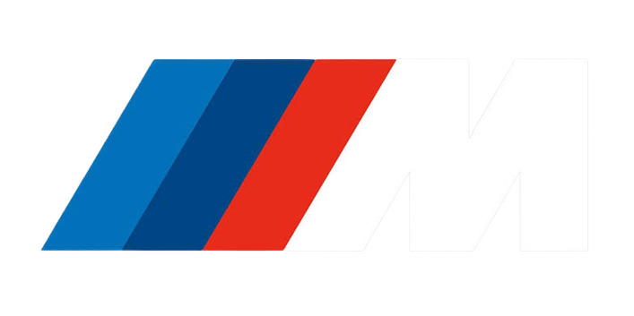
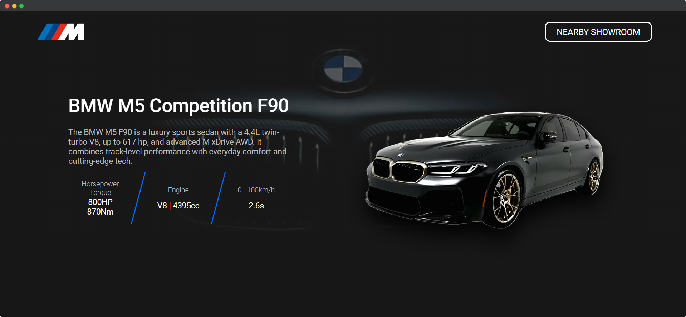

#  BMW M-Sports

As a devoted admirer of the **BMW M5 F90**, I designed this landing page to pay tribute to one of the best luxury sports sedans ever crafted. The page highlights its stunning design, engineering brilliance, and unmatched performance.

## 🌟 Why This Project?
The BMW M5 F90 stands as a perfect blend of elegance, power, and innovation. Being a fan of its incredible features and timeless design, I wanted to create a digital showcase that reflects its true essence.


## 🚀 Features

- **Dedicated to BMW M5 F90 Fans**: A landing page created by a fan, for fans.
- **Visual Elegance**: High-quality images and a sleek design to highlight the car's beauty.
- **Performance Highlights**: Showcase the car's specs, including its 617 hp V8 engine and M xDrive AWD system.
- **Interactive Elements**: Smooth animations and responsive design for a modern experience.


##  📸 Preview
A quick glimpse of the BMW M5 F90 Fanpage.


## 🌐 Live Preview
Experience the landing page live [here](https://developer-pranav.github.io/bmw-msports/index.html).

## 🛠️ Tech Stack

- HTML
- CSS
- JavaScript

## 💾 Installation

### Prerequisites

- A modern web browser (Chrome, Firefox, Safari, etc.)


### Steps of Installaion

1. Clone the repository:
    ```bash
    git clone https://github.com/developer-pranav/bmw-msports.git
    cd bmw-msports
    ```

2. Open the `index.html` file in your web browser.


## 📄 License

This project is licensed under the MIT License - see the [LICENSE](LICENSE.txt) file for details.

## 🤝 Contributing
If you're also a fan of the BMW M5 F90 and have ideas to improve this project, feel free to fork the repo and create a pull request.

## 📞 Contact

For any questions or suggestions, please open an issue or contact [DeveloperPranav](mailto:developer.pranav3306@gmail.com).
